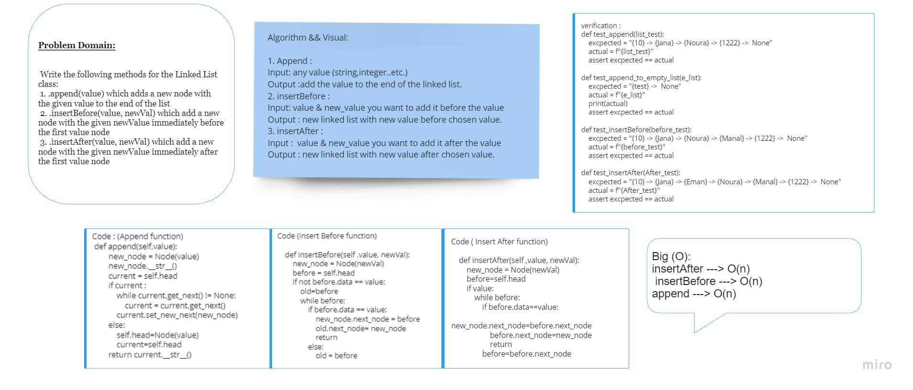

# Code Challenge 6 :

* A linked list is a linear data structure where each element is a separate object. Linked list elements are not stored at contiguous location; the elements are linked using pointers.

# Challenge
* Write the following methods for the Linked List class:
 1. .append(value) which adds a new node with the given value to the end of the list
 2. .insertBefore(value, newVal) which add a new node with the given newValue immediately before the first value node
 3. .insertAfter(value, newVal) which add a new node with the given newValue immediately after the first value node

# Approach & Efficiency
* 

+ insert ---> O(1)
+ includes ---> O(n)
+ insertAfter ---> O(n)
+ insertBefore ---> O(n)
+ append ---> O(n)
+ __str__ ---> O(n)

# Code
* [code](linked_list.py)

### Note :
* Mahmoud Al-Zoubi helped me understand the insertBefore function.

