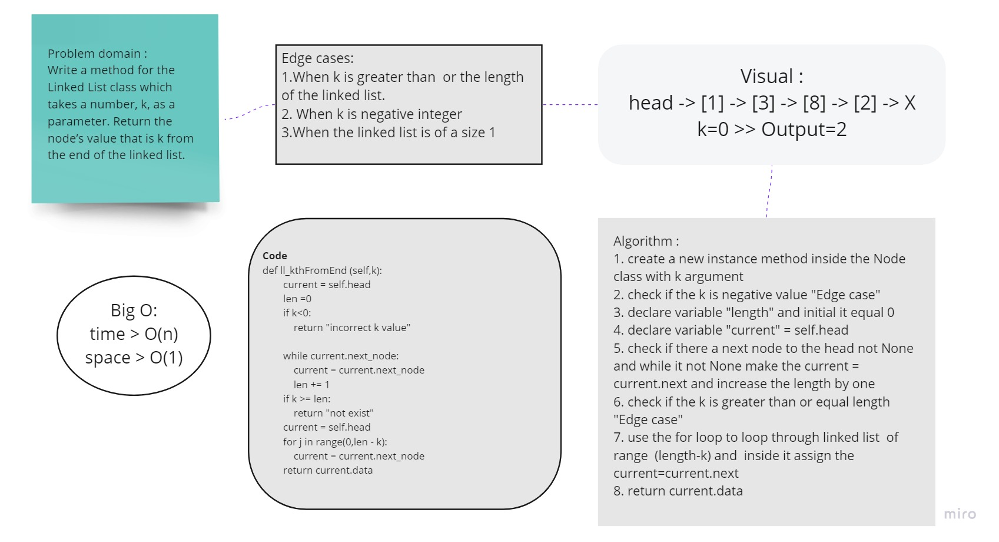

# Code Challenge 7 :

# Challenge
* Write a method for the Linked List class which takes a number, k, as a parameter. Return the node’s value that is k from the end of the linked list.

# Approach & Efficiency
* 

# Code
* [code](linked_list.py)

# Tasks :
- [x] Top-level README “Table of Contents” is updated
- [x] Feature tasks for this challenge are completed
- [x] Unit tests written and passing
- [x] “Happy Path” - Expected outcome
- [x] Expected failure
- [x] Edge Case (if applicable/obvious)
- [x] README for this challenge is complete
- [x] Description, Approach & Efficiency, Solution
- [x] Link to code

