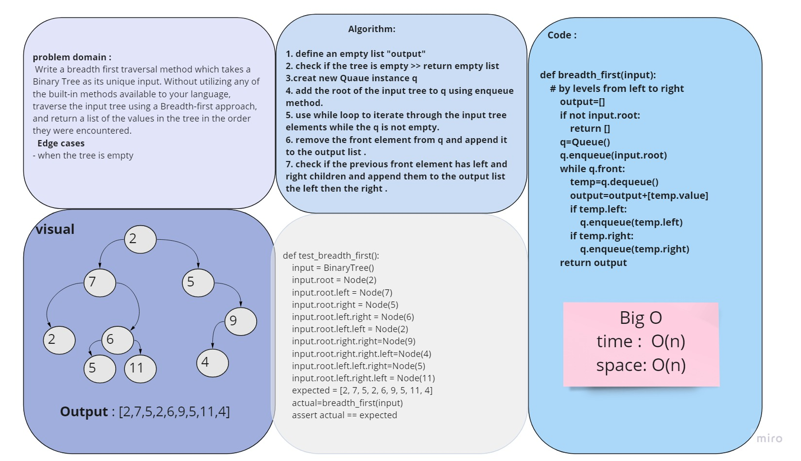

# Code Challenge 17 :
## Breadth-first Traversal.

## Challenge
* Write a breadth first traversal method which takes a Binary Tree as its unique input. Without utilizing any of the built-in methods available to your language, traverse the input tree using a Breadth-first approach, and return a list of the values in the tree in the order they were encountered.

## Approach & Efficiency:
### Whiteboard:

* Big O :
 - Time O(n)
 - Space O(n)

# Tasks:
- [x] Top-level README “Table of Contents” is updated
- [x] Feature tasks for this challenge are completed
- [x] Unit tests written and passing
- [x] Edge Case (if applicable/obvious)
- [x] README for this challenge is complete
- [x] Description, Approach & Efficiency, Solution
- [x] Link to code

* [code](breadth_first.py)
