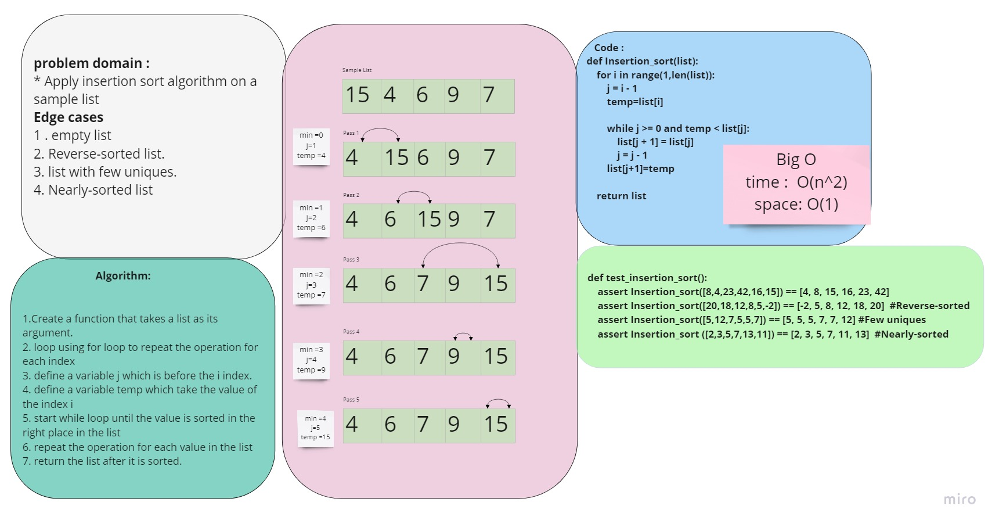

# Code Challenge 26 :
## Insertion Sort
* Insertion Sort is a sorting algorithm that traverses the array multiple times as it slowly builds out the sorting sequence. The traversal keeps track of the minimum value and places it in the front of the array which should be incrementally sorted.
## Challenge
* Provide a visual step through the sample arrays based on the provided pseudo code
* Convert the pseudo-code into working code in your language
* Present a complete set of working tests

## Approach & Efficiency:
### Whiteboard:

### Efficiency (Big O) :
* Time: O(n^2)
  - The basic operation of this algorithm is comparison. This will happen n * (n-1) number of times…concluding the algorithm to be n squared.
* Space: O(1)
  - This list is being sorted in place…keeping the space at constant O(1).

# Tasks:
- [x] Top-level README “Table of Contents” is updated
- [x] Feature tasks for this challenge are completed
- [x] Unit tests written and passing
- [x] Edge Case (if applicable/obvious)
- [x] README for this challenge is complete
- [x] Description, Approach & Efficiency, Solution
- [x] Link to code

* [code](Insertion_sort.py)
* [Trace example](BLOG.md)
