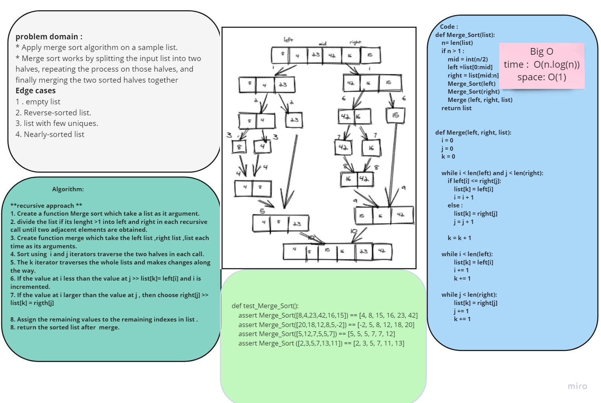

# Code Challenge 27 :
## Merge Sort
* Merge sort works by splitting the input list into two halves, repeating the process on those halves, and finally merging the two sorted halves together

## Challenge
* Provide a visual step through for each of the sample arrays based on the provided pseudo code
* Convert the pseudo-code into working code in your language
* Present a complete set of working tests

## Approach & Efficiency:
### Whiteboard:

### Efficiency (Big O) :
* Time complexity >>  O(n.logn) because the list is being split in log(n) calls and the merging process takes linear time in each call.
* Space complexity >> O(1)

# Tasks:
- [x] Top-level README “Table of Contents” is updated
- [x] Feature tasks for this challenge are completed
- [x] Unit tests written and passing
- [x] Edge Case (if applicable/obvious)
- [x] README for this challenge is complete
- [x] Description, Approach & Efficiency, Solution
- [x] Link to code

* [code](Merge_Sort.py)
* [Trace example](BLOG.md)