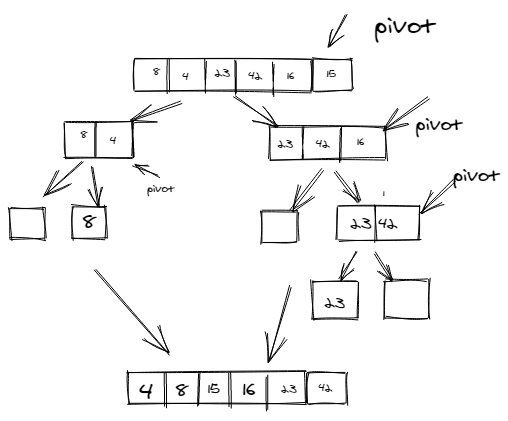

# Trace
# Algorithm :
1. Select pivot as the last element, and we start to partition (or divide) the array for the first time.
2. In this partitioning algorithm, the array is broken into 2 sub-lists such that all the elements smaller than the pivot will be on the left side of the pivot and all the elements greater than the pivot will be on the right side of it.
3. And the pivot element will be at its final sorted position.
4. The elements in the left and right sub-lists do not have to be sorted.
5. Then we recursively pick the left and right sub-lists, and we perform partitioning on each of them by choosing a pivot in the sub-lists and the steps are repeated for the same.

## Sample list =[8,4,23,42,16,15]
#### Pass 1:
* pivot =15
* first sub list which contain the numbers less than 15 >> [8,4]
* Second sub list which contain the numbers larger than 15>>[23,42,16]

#### Pass 2:
* pivot = 4
* 4 swap with 8
* [4,8,15,23,42,16]

#### Pass 3:
* pivot =16
* first sub list which contain the numbers less than 16  >> [4,8,15]
* Second sub list which contain the numbers larger than 16 >> [23,42]

### Pass 4:
* the list is sorted[4,8,15,16,23,42]

* 
