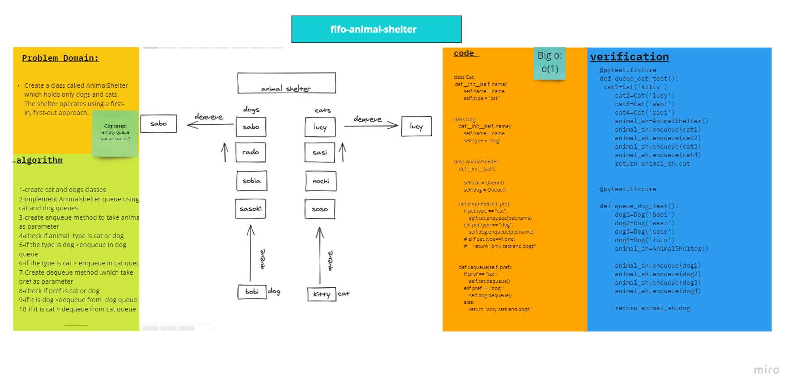

# Code Challenge 12 :
## FIFO Animal Shelter
## Challenge
* Create a class called AnimalShelter which holds only dogs and cats. The shelter operates using a first-in, first-out approach.
Implement the following methods:
  1. enqueue(animal): adds animal to the shelter. animal can be either a dog or a cat object.
  2. dequeue(pref): returns either a dog or a cat. If pref is not "dog" or "cat" then return null.

## Approach & Efficiency:
### Whiteboard:

* Big O :
 - O(1)

# Tasks:
- [x] Top-level README “Table of Contents” is updated
- [x] Feature tasks for this challenge are completed
- [x] Unit tests written and passing
- [x] “Happy Path” - Expected outcome
- [x] Expected failure
- [x] Edge Case (if applicable/obvious)
- [x] README for this challenge is complete
- [x] Description, Approach & Efficiency, Solution
- [x] Link to code

* [code](fifo_animal_shelter.py)
