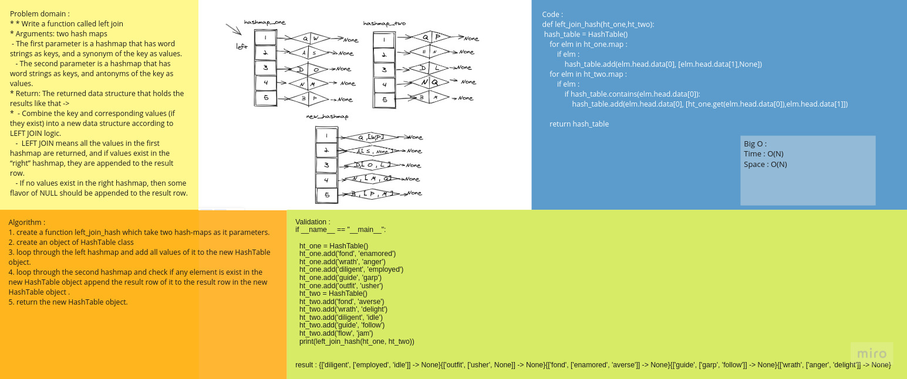

# Code Challenge 33 :
## Implement a simplified LEFT JOIN for 2 Hashmaps.
## Challenge
* Write a function called left join
* Arguments: two hash maps
   - The first parameter is a hashmap that has word strings as keys, and a synonym of the key as values.
   - The second parameter is a hashmap that has word strings as keys, and antonyms of the key as values.
* Return: The returned data structure that holds the results like that -> 
*  - Combine the key and corresponding values (if they exist) into a new data structure according to LEFT JOIN logic.
   -  LEFT JOIN means all the values in the first hashmap are returned, and if values exist in the “right” hashmap, they are appended to the result row.
   - If no values exist in the right hashmap, then some flavor of NULL should be appended to the result row.

## Approach & Efficiency:
### Whiteboard:
- 

### Efficiency (Big O) :
* Big O :
* Time O(n+m)
* Space O(n+m)

# Tasks:
- [x] Top-level README “Table of Contents” is updated
- [x] Feature tasks for this challenge are completed
- [x] Unit tests written and passing
- [x] Edge Case (if applicable/obvious)
- [x] README for this challenge is complete
- [x] Description, Approach & Efficiency, Solution
- [x] Link to code

* [code](hashmap_left_join.py)