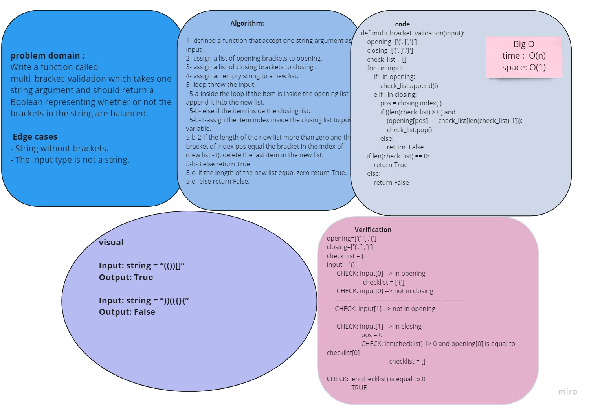

# Code Challenge 13 :
## multi-bracket-validation

# Challenge
* Write a function called **multi_bracket_validation** which takes one string argument and should return a boolean representing whether or not the brackets in the string are balanced.

# Approach & Efficiency
* 

# Code
* [code](multi_bracket_validation.py)

# Tasks :
- [x] Top-level README “Table of Contents” is updated
- [x] Feature tasks for this challenge are completed
- [x] Unit tests written and passing
- [x] “Happy Path” - Expected outcome
- [x] Expected failure
- [x] Edge Case (if applicable/obvious)
- [x] README for this challenge is complete
- [x] Description, Approach & Efficiency, Solution
- [x] Link to code

* Note : This code challenge was resolved as a collaborative work with Manar, Raneem, Nour and Tala
