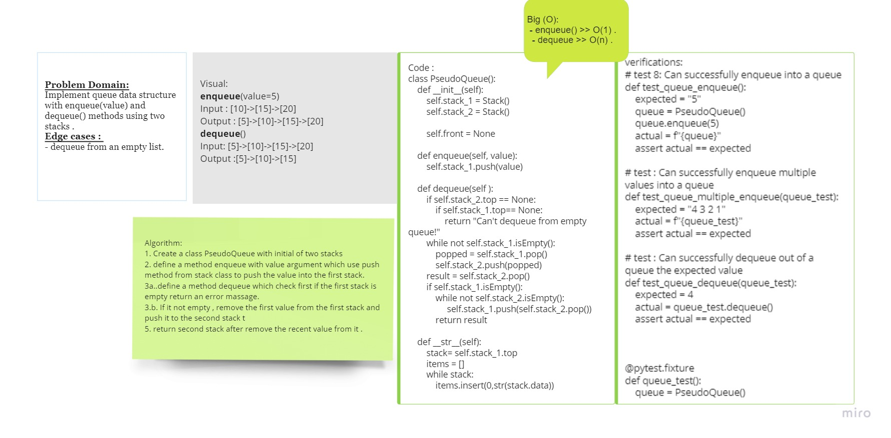

# Code Challenge 11 :
## Implement queue from two stacks

## Challenge
* Create a brand new PseudoQueue class. Do not use an existing Queue. Instead, this PseudoQueue class will implement our standard queue interface (the two methods listed below), but will internally only utilize 2 Stack objects. Ensure that you create your class with the following methods:
 1. enqueue(value) which inserts value into the PseudoQueue, using a first-in, first-out approach.
 2. dequeue() which extracts a value from the PseudoQueue, using a first-in, first-out approach.
* The Stack instances have only push, pop, and peek methods. You should use your own Stack implementation. Instantiate these Stack objects in your PseudoQueue constructor.

## Approach & Efficiency:
### Whiteboard:

* Big O :
  - enqueue() >> O(1) .
  - dequeue >> O(n) .

# Tasks:
- [x] Top-level README “Table of Contents” is updated
- [x] Feature tasks for this challenge are completed
- [x] Unit tests written and passing
- [x] “Happy Path” - Expected outcome
- [x] Expected failure
- [x] Edge Case (if applicable/obvious)
- [x] README for this challenge is complete
- [x] Description, Approach & Efficiency, Solution
- [x] Link to code

* [code](queue_with_stacks.py)
