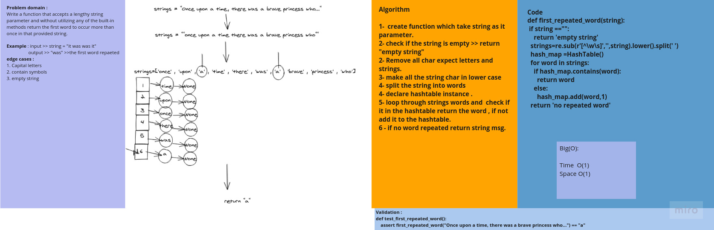

# Code Challenge 31 :
## Find the first repeated word in a book.
## Challenge
* Write a function that accepts a lengthy string parameter.
* Without utilizing any of the built-in library methods available to your language, return the first word to occur more than once in that provided string.

## Approach & Efficiency:
### Whiteboard:
- 

- **Solution 2**
- 
# Tasks:
- [x] Top-level README “Table of Contents” is updated
- [x] Feature tasks for this challenge are completed
- [x] Unit tests written and passing
- [x] Edge Case (if applicable/obvious)
- [x] README for this challenge is complete
- [x] Description, Approach & Efficiency, Solution
- [x] Link to code

* [code](repeated_word.py)

