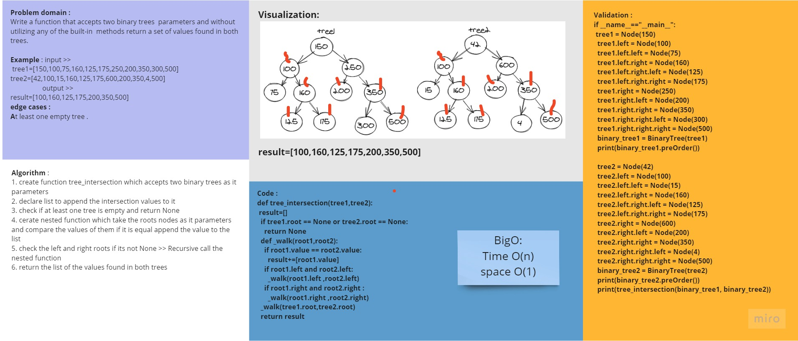

# Code Challenge 32 :
## Find common values in 2 binary trees.
## Challenge
* Write a function called tree_intersection that takes two binary tree parameters.
* Without utilizing any of the built-in library methods available to your language, return a set of values found in both trees.

## Approach & Efficiency:
### Whiteboard:
- 

### Efficiency (Big O) :
* Big O :
* Time O(n)
* Space O(1)

# Tasks:
- [x] Top-level README “Table of Contents” is updated
- [x] Feature tasks for this challenge are completed
- [x] Unit tests written and passing
- [x] Edge Case (if applicable/obvious)
- [x] README for this challenge is complete
- [x] Description, Approach & Efficiency, Solution
- [x] Link to code

* [code](tree_intersection.py)
