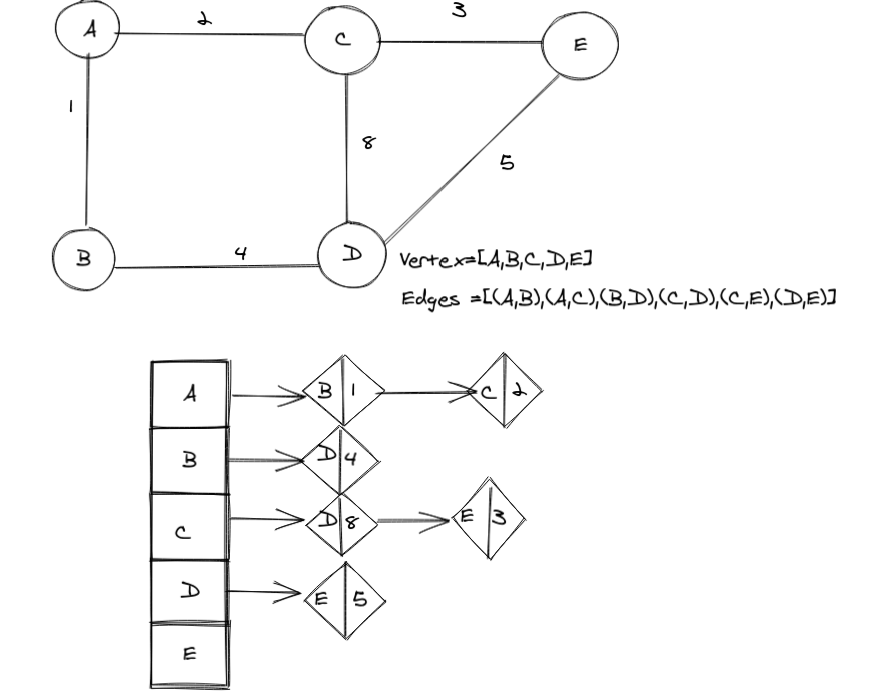
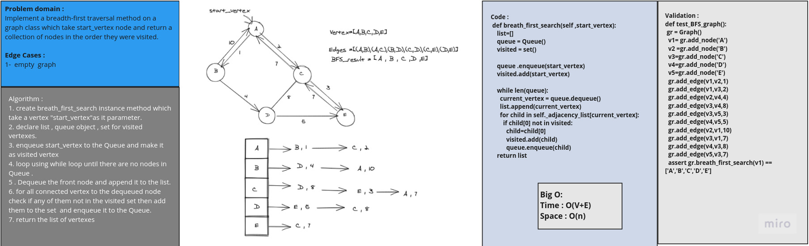

# Code challenge 35
## Implementation Graphs
* A Graph is a non-linear data structure consisting of nodes and edges. The nodes are sometimes also referred to as vertices and the edges are lines or arcs that connect any two nodes in the graph.

## Challenge :
* Implement Graph data structure. The graph should be represented as an adjacency list, and should include the following methods: add node(),add edge(), get nodes(), get neighbors(),size()
* Write tests to prove the following functionality:
  - Node can be successfully added to the graph
  - An edge can be successfully added to the graph
  - A collection of all nodes can be properly retrieved from the graph
  - All appropriate neighbors can be retrieved from the graph
  - Neighbors are returned with the weight between nodes included
  - The proper size is returned, representing the number of nodes in the graph
  - A graph with only one node and edge can be properly returned
  - An empty graph properly returns null

 
## Approach & Efficiency:
* 
* Big O :
- Time : O(1)
- Space : O(1)

## API :
* add node
    - Arguments: value
    - Returns: The added node
    - Add a node to the graph
 * add edge
    - Arguments: 2 nodes to be connected by the edge, weight (optional)
    - Returns: nothing
    - Adds a new edge between two nodes in the graph
    - If specified, assign a weight to the edge
    - Both nodes should already be in the Graph
 * get nodes
    - Arguments: none
    - Returns all of the nodes in the graph as a collection (set, list, or similar)
 * get neighbors
    - Arguments: node
    - Returns a collection of edges connected to the given node
    - Include the weight of the connection in the returned collection
 * size
    - Arguments: none
    - Returns the total number of nodes in the graph

## Tasks checklist:
- [x] Top-level README “Table of Contents” is updated
- [x] Feature tasks for this challenge are completed
- [x] Unit tests written and passing
- [x] “Happy Path” - Expected outcome
- [x] Expected failure
- [x] Edge Case (if applicable/obvious)
- [x] README for this challenge is complete
- [x] Description, Approach & Efficiency, Solution
- [x] Link to code

########################################################################
# Code challenge 36
## Implement a breadth-first traversal on a graph.
## Challenge :
* Write the following method for the Graph class:
      - breadth first
         - Arguments: Node
         - Return: A collection of nodes in the order they were visited.
         - Display the collection
   
## Approach & Efficiency:
* 
* Big O :
- Time : O(V+E)
- Space : O(n)

## Tasks checklist:
- [x] Top-level README “Table of Contents” is updated
- [x] Feature tasks for this challenge are completed
- [x] Unit tests written and passing
- [x] “Happy Path” - Expected outcome
- [x] Expected failure
- [x] Edge Case (if applicable/obvious)
- [x] README for this challenge is complete
- [x] Description, Approach & Efficiency, Solution
- [x] Link to code

* [code](graph.py)
